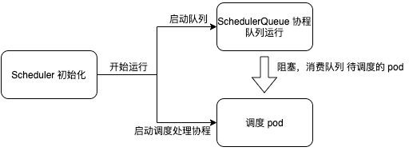
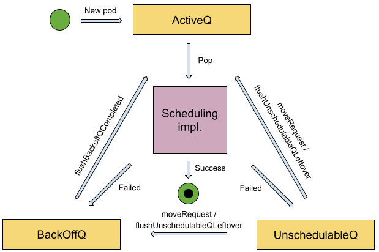
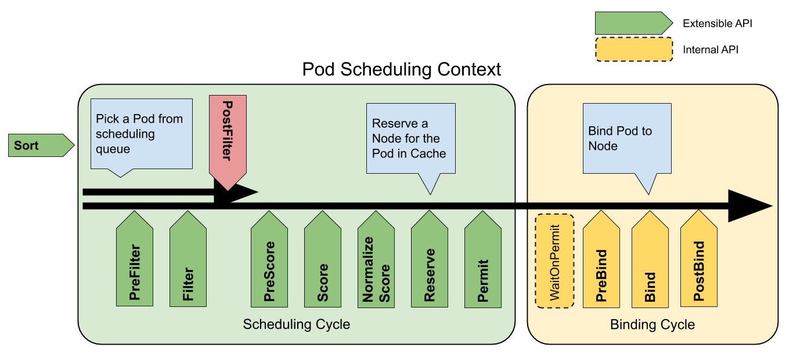

# Scheduler

> k8s Scheduler 源码阅读的相关笔记资料
> 

## k8s scheduler 功能概述

简单一句话来说，就是调度 kubernetes 集群中的 pod ，选择合适的节点。 本篇读书笔记将会从大到小详细的介绍 kube-scheduler 功能， 调度一个 pod 的完整流程是如何的，具体是如何实现的，调度算法是如何实现等等。

### 调度 pod 的完整流程

集群中 pod 调度过程，通过一个队列中获取需要调度的 pod， 然后根据相关的调度算法，选择一个最合适的机器，再将 pod 的绑定到指定的节点，完成 pod 的调度


实际的调度过程中，调度的队列有许多相关的设计，以及调度算法的设计，调度算法要支持插件的形式，如何暴露自定义的相关调度算法，如何将 pod 调度到指定的节点信息持久化，指定机器上拉起对应的pod。上述的图非常简单的介绍了一下 pod 的调度过程，对于调度的整体逻辑可以按照这个来理解。 kube-scheduler 的代码放在 /kubernetes/scheduler 文件夹中，入口放在 /kubernetes/cmd/app 中，kube-scheduler 启动的代码流程如下



```go
// Scheduler 启动
// Run begins watching and scheduling. It starts scheduling and blocked until the context is done.
func (sched *Scheduler) Run(ctx context.Context) {
	// 启动队列
	sched.SchedulingQueue.Run()

	// We need to start scheduleOne loop in a dedicated goroutine,
	// because scheduleOne function hangs on getting the next item
	// from the SchedulingQueue.
	// If there are no new pods to schedule, it will be hanging there
	// and if done in this goroutine it will be blocking closing
	// SchedulingQueue, in effect causing a deadlock on shutdown.
	// 调度具体的某一个 pod 
	go wait.UntilWithContext(ctx, sched.scheduleOne, 0)

	<-ctx.Done()
	sched.SchedulingQueue.Close()
}
```

### 调度队列实现细节

存在三种调度队列：

`activeQ`: 等待调度的 pod 队列，是一个最大堆

`podBackoffQ`:  根据退避时间组成的一个 pod 队列，也是一个堆，会将满足回退时间的 pod 返回给 activeQ

`unschedulablePods`:  保存曾经尝试确定不可调度的 pods 列表

调度队列启动的时候，分别会拉起两个协程

- `flushBackoffQCompleted` 每秒运行一次， 负责将 backoffQ 的队列中超过回避时间的 pod 迁移到 activeQ 中
- `flushUnschedulablePodsLeftover` 每 30 秒运行一次, 将上一次未被调度的 pod 拿出来，如果这个 pod 回退时间已经到了的话，放到 activeQ 中，未到的话放到 backoffQ 中



### 调度算法执行

从 acitveQ 队列中拿出一个 pod 来执行调度

```go
func (p *PriorityQueue) Pop() (*framework.QueuedPodInfo, error) {
	p.lock.Lock()
	defer p.lock.Unlock()
	for p.activeQ.Len() == 0 {
		// When the queue is empty, invocation of Pop() is blocked until new item is enqueued.
		// When Close() is called, the p.closed is set and the condition is broadcast,
		// which causes this loop to continue and return from the Pop().
		if p.closed {
			return nil, fmt.Errorf(queueClosed)
		}
		p.cond.Wait()
	}
	obj, err := p.activeQ.Pop()
	if err != nil {
		return nil, err
	}
	pInfo := obj.(*framework.QueuedPodInfo)
	pInfo.Attempts++
	p.schedulingCycle++
	return pInfo, nil
}
```

同步的先帮助 pod 选择一个合适的节点， 先做一个 prefit 挑选出可以调度的节点，再通过优选选择一个最合适的节点，然后再异步的将 pod 实际调度到真实的节点上， 



- `preFilter`: 预处理 Pod 的相关信息，或者检查集群或 Pod 必须满足的某些条件。 如果 PreFilter 插件返回错误，则调度周期将终止
- `filter`: 过滤出不能运行该 Pod 的节点。对于每个节点， 调度器将按照其配置顺序调用这些过滤插件。如果任何过滤插件将节点标记为不可行， 则不会为该节点调用剩下的过滤插件。节点可以被同时进行评估
- `postFiler`: Filter 阶段后调用，但仅在该 Pod 没有可行的节点时调用。 插件按其配置的顺序调用。如果任何 PostFilter 插件标记节点为“Schedulable”， 则其余的插件不会调用。典型的 PostFilter 实现是抢占，试图通过抢占其他 Pod 的资源使该 Pod 可以调度。
- `PreStore`: 这些插件用于执行 “前置评分（pre-scoring）” 工作，即生成一个可共享状态供 Score 插件使用。 如果 PreScore 插件返回错误，则调度周期将终止。
- `Score`: 这些插件用于对通过过滤阶段的节点进行排序。调度器将为每个节点调用每个评分插件。 将有一个定义明确的整数范围，代表最小和最大分数。 在[标准化评分](https://kubernetes.io/zh-cn/docs/concepts/scheduling-eviction/scheduling-framework/#normalize-scoring)阶段之后，调度器将根据配置的插件权重 合并所有插件的节点分数。
- `Normalize Score`: 这些插件用于在调度器计算 Node 排名之前修改分数。 在此扩展点注册的插件被调用时会使用同一插件的 [Score](https://kubernetes.io/zh-cn/docs/concepts/scheduling-eviction/scheduling-framework/#scoring) 结果。 每个插件在每个调度周期调用一次。
- `PreBind`: 这些插件用于执行 Pod 绑定前所需的所有工作。 例如，一个 PreBind 插件可能需要制备网络卷并且在允许 Pod 运行在该节点之前 将其挂载到目标节点上。
- `Bind`: Bind 插件用于将 Pod 绑定到节点上。直到所有的 PreBind 插件都完成，Bind 插件才会被调用。 各 Bind 插件按照配置顺序被调用。Bind 插件可以选择是否处理指定的 Pod。 如果某 Bind 插件选择处理某 Pod，**剩余的 Bind 插件将被跳过**。
- `PostBind`: 这是个信息性的扩展点。 PostBind 插件在 Pod 成功绑定后被调用。这是绑定周期的结尾，可用于清理相关的资源。


如果 pod 调度失败的话，会再次回到 backoffQ 或者 unscheduleable 队列中